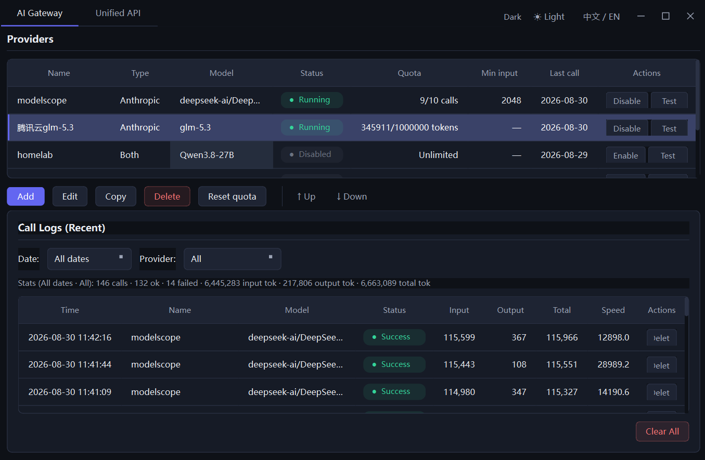

# LightAIBox · Lightweight AI Toolbox

[简体中文](README.zh-CN.md) | English

A PySide6 desktop gateway that unifies multiple LLM API providers (OpenAI-compatible / Anthropic) behind a single local entry point, with smart scheduling, quota control, and call logging. Manage and reuse multiple model keys from one place.

 



## Features

- **Unified API proxy** — a single `chat` / `chat_stream` interface hides the OpenAI / Anthropic protocol differences. Call a specific model, or leave it unset to auto-select a provider by policy.
- **Claude Code ready** — the Anthropic-compatible endpoint fully passes through `tools` and multi-turn `tool_result`, with spec-compliant streaming `tool_use` events, so it can drive Claude Code's multi-step agent loop directly.
- **Built-in AI chat** — a WeChat-style chat tab right in the app: streaming replies, Markdown + offline MathJax-rendered LaTeX and mermaid diagrams, a per-reply **Raw / Render** toggle, and time separators (see [Built-in Chat](#built-in-chat)).
- **Multiple providers** — add / edit / copy / delete providers (name, protocol, base URL, API key, model), with background connectivity testing that never blocks the UI.
- **Smart scheduling** — pick among available providers by policy (long-input-first / short-input-first), with automatic fallback on failure.
- **Quota control** — limit by call count or token count; auto-disables a provider when it exceeds quota, resettable in one click.
- **Call logging & stats** — SQLite-persisted records of tokens, latency, speed, and status per call, filterable by date / provider, with aggregated statistics.
- **Floating Provider bar** — an independent, always-on-top, translucent panel floating at the bottom of the screen that lists every running provider and its remaining quota at a glance. It stays visible even when the main window is minimized to the tray; drag it anywhere, or click the lock button to stop it moving. Toggled from the corner of the tab bar (state remembered across restarts).
- **Runs in the background** — closing the window minimizes it to the system tray while the unified API keeps serving. Single-click the tray icon to show / hide the window; right-click for show / quit.

## When to use Auto Mode

The `auto` model (adaptive scheduling) is especially recommended when:

1. **Your model API has a quota limit** — when one provider hits its token
   limit, LightAIBox automatically switches to the next available one, so your
   AI coding session never gets interrupted mid-flight.
2. **You're juggling multiple free/limited accounts** — providers are picked
   automatically by priority / quota / input length, so you can squeeze the
   most out of every free token. Cyber-beggar friendly. 🫙

## Quick Start

```bash
# 1. Install dependencies
pip install -r requirements.txt

# 2. Run
python -m app.main
```

The database is created automatically on first run in the user data directory
(`%APPDATA%/LightAIBox/lightbox.db` on Windows, `~/.local/share/LightAIBox/` on
Linux, `~/Library/Application Support/LightAIBox/` on macOS).

### Add a provider

Click **Add** in the provider list and fill in the name (unique), protocol type, base URL (the trailing `/v1` is optional), API key, and model. Then use the row buttons to edit / copy / delete / enable-disable / reset quota / test connectivity.

## Unified API (HTTP)

A local HTTP server exposes the gateway to external tools (curl / OpenAI SDK / Anthropic SDK / Claude Code) and **auto-starts with the app**, so it works out of the box on `127.0.0.1:8765`.

- OpenAI-compatible: `POST /v1/chat/completions`, `GET /v1/models`
- Anthropic-compatible: `POST /v1/messages`

```bash
curl -s http://127.0.0.1:8765/v1/chat/completions \
  -H "Content-Type: application/json" \
  -d '{"model":"auto","messages":[{"role":"user","content":"Hello"}]}'
```

### Use with Claude Code

```bash
ANTHROPIC_BASE_URL=http://127.0.0.1:8765 \
ANTHROPIC_API_KEY=anything \
ANTHROPIC_MODEL=<model-name> \
claude
```

## Built-in Chat

The **对话 (Chat)** tab is a full in-app chat window modeled after WeChat and driven by the
same gateway, so it works with any configured provider (or `auto` scheduling):

- **WeChat-style message stream** — rounded-rectangle avatars ("AI" / "Me") in the app's
  indigo color, bubbles with directional tails pointing at the avatar, asymmetric corner
  radii, and centered time separators (shown for the first message and whenever two
  messages are more than 5 minutes apart).
- **Real-time streaming** — replies stream into a live bubble as tokens arrive; a **Stop**
  button cancels the current generation. **Smart scrolling**: while streaming, the view only
  auto-follows the bottom if you're already at the bottom — if you scroll up to read earlier
  content it stays put instead of being yanked back down by each token.
- **Markdown + LaTeX** — replies are rendered from Markdown, and LaTeX is typeset by the
  **locally bundled MathJax v3** (fully offline) using `\(...\)` / `\[...\]` (also
  `$...$` / `$$...$$`). Fenced blocks declared as `latex` / `tex` / `math` are rendered as
  centered display math (`%` comments stripped); other code fences stay styled code blocks.
- **Mermaid diagrams** — ` ```mermaid ` fences are rendered into SVG by the **locally
  bundled mermaid v10** (fully offline), themed to match the current dark / light UI.
- **Raw / Render toggle** — a link under each assistant reply flips it between the raw
  Markdown and the rendered view.
- **Theme-aware** — bubble / avatar / time colors follow the dark / light theme; the chat
  canvas is transparent so theme switches apply instantly with no one-frame lag, and a thin
  (6px) scrollbar keeps it unobtrusive.

## Project Structure

```
app/
├── main.py          # entry point (init DB, auto-start unified API, launch window)
├── config.py        # config & constants
├── models.py        # domain models
├── client.py        # unified LLM client (OpenAI / Anthropic)
├── gateway.py       # gateway: scheduling + quota + logging
├── server.py        # unified API service (FastAPI + uvicorn)
├── db.py            # SQLite persistence
├── chat_session.py  # chat session: multi-turn history + display timestamps
└── ui/              # PySide6 UI
    ├── chat_page.py # Chat tab: WeChat-style bubbles + MathJax rendering
    ├── providers_bar.py # floating always-on-top panel: running providers + quota
    └── resources/chat/  # chat container HTML + bundled MathJax v3 + mermaid (offline)
```

## Packaging (build a distributable executable)

LightAIBox can be packaged into a standalone executable using PyInstaller. A
ready-to-use spec file is provided.

```bash
# Windows (Git Bash / MSYS)
bash build_windows.sh
# or directly:
python -m PyInstaller --clean --noconfirm lightaibox.spec
```

Output lands in `dist/LightAIBox/LightAIBox.exe` (onedir bundle — ship the whole
`dist/LightAIBox/` folder).

Notes:

- The build **must run on the target OS** — PyInstaller does not cross-compile.
  Build on Windows for a Windows `.exe`, on macOS for a `.app`, on Linux for an
  ELF binary.
- Read-only resources (`app/resources/styles/*.qss`) are bundled and resolved via
  `sys._MEIPASS` at runtime (`app/config.py`).
- Writable data (SQLite DB) goes to the per-user data directory, **not** the
  bundle — see Quick Start above.
- uvicorn / fastapi use dynamic imports, handled explicitly in `hiddenimports`.
- The exe is built with `console=False` (no terminal window).

## License

This project is released under the [MIT License](LICENSE). You are free to use,
modify, and distribute it, including for commercial purposes.

## Acknowledgements

Special thanks to **my wife** for the Alibaba Cloud account — one more source of
free model tokens to scrape by on. 💖
