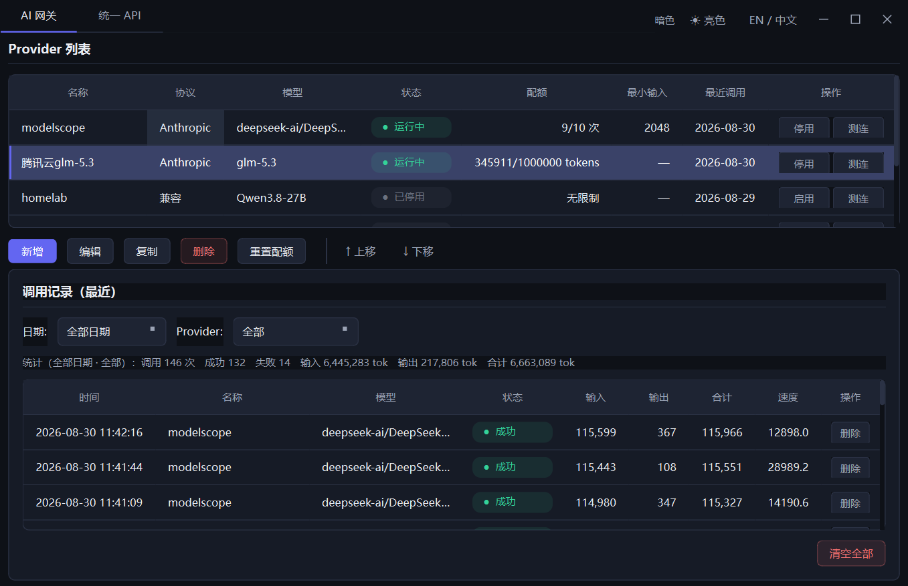

# LightAIBox · 轻量化 AI 工具箱

中文 | [English](README.md)

基于 **PySide6** 的桌面端轻量级 AI 网关工具：把多个大模型 API 提供方（OpenAI 兼容 / Anthropic）统一到一个本地入口，提供调度、配额、调用记录等能力，在本地集中管理并复用多套大模型密钥。

 



## 特性

- **统一 API 代理**：`chat` / `chat_stream` 一个接口屏蔽 OpenAI 与 Anthropic 协议差异，支持指定模型与按策略自适应、一次性与流式输出。
- **Claude Code 直连**：Anthropic 兼容端点完整透传 `tools` 与多轮 `tool_result`，流式 tool_use 遵循官方协议，可直接承载多步 agent 循环。
- **多 Provider 管理**：可视化增删改查，后台测连不卡界面、无弹窗。
- **智能调度**：按策略（长输入优先 / 短输入优先）挑选，单 Provider 失败自动降级重试。
- **配额控制**：按调用次数或 token 数设限，超配额自动停用、可一键重置。
- **调用记录与统计**：SQLite 持久化，支持按日期 / Provider 过滤并汇总调用次数、成功率与 token 用量。
- **后台常驻**：关闭窗口即最小化到系统托盘，统一 API 服务继续在后台运行；单击托盘图标显示 / 隐藏窗口，右键菜单可显示或彻底退出。

## 推荐使用自动模式的场景

`auto` 模型（自适应调度）尤其推荐在以下场景使用：

1. **大模型 API 存在限额**：某个 Provider 超出 token 限额后自动切换到下一个可用 Provider，避免 AI 编程中途中断。
2. **多套免费 / 受限账号轮换**：按优先级 / 限额 / 输入长度自动挑选模型，把每一份免费 token 都榨干用尽，赛博乞丐友好。🫙

## 快速开始

```bash
# 安装依赖
pip install -r requirements.txt

# 运行
python -m app.main
```

首次运行自动在用户数据目录创建数据库（Windows 为 `%APPDATA%/LightAIBox/lightbox.db`，Linux 为 `~/.local/share/LightAIBox/`，macOS 为 `~/Library/Application Support/LightAIBox/`）。

### 添加 Provider

点击 Provider 列表「新增」，填写名称（唯一）、协议类型、Base URL（末尾 `/v1` 可省略）、API Key、模型。随后可在列表中编辑 / 复制 / 删除 / 启用停用 / 重置配额 / 测连。

## 统一 API 服务（HTTP）

本地 HTTP 服务**随应用启动自动拉起**，开箱即用（默认 `127.0.0.1:8765`）；也可在「统一 API」页手动停止 / 启动。

- OpenAI 兼容：`POST /v1/chat/completions`、`GET /v1/models`
- Anthropic 兼容：`POST /v1/messages`

```bash
curl -s http://127.0.0.1:8765/v1/chat/completions \
  -H "Content-Type: application/json" \
  -d '{"model":"auto","messages":[{"role":"user","content":"你好"}]}'
```

### 接入 Claude Code

```bash
ANTHROPIC_BASE_URL=http://127.0.0.1:8765 \
ANTHROPIC_API_KEY=anything \
ANTHROPIC_MODEL=<模型名> \
claude
```

## 目录结构

```
app/
├── main.py          # 程序入口（初始化 DB + 拉起统一 API + 启动窗口）
├── config.py        # 配置与常量
├── models.py        # 领域数据模型
├── client.py        # 统一大模型客户端
├── gateway.py       # 网关：调度 + 配额 + 调用记录
├── server.py        # 统一 API 服务（FastAPI + uvicorn）
├── db.py            # SQLite 持久化
└── ui/              # PySide6 界面
```

## 许可证

本项目采用 [MIT 许可证](LICENSE)，可自由使用、修改与分发，含商业用途。

## 特别鸣谢

感谢**老婆大人**提供的阿里云账号，让我能多蹭一份免费的大模型 token。💖
